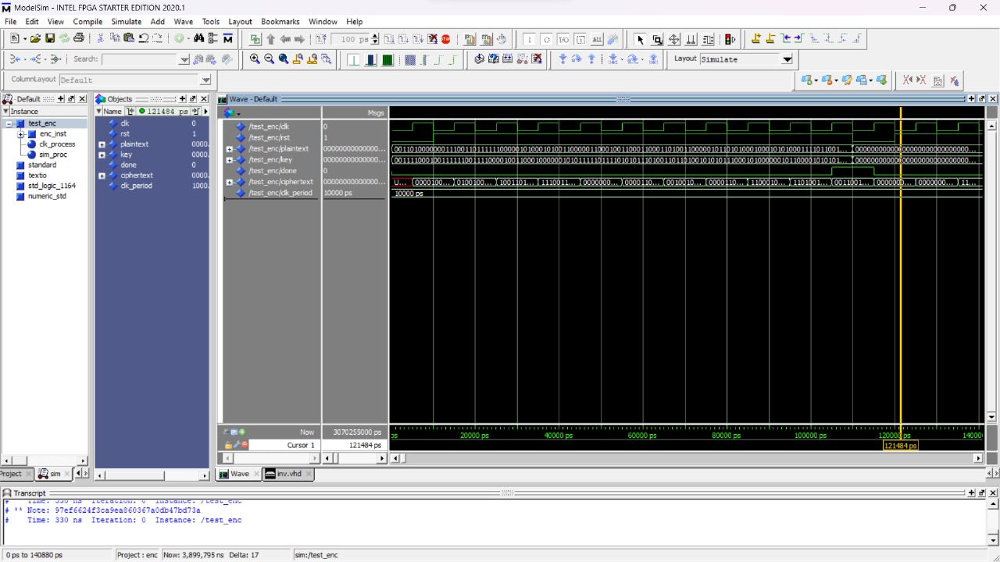
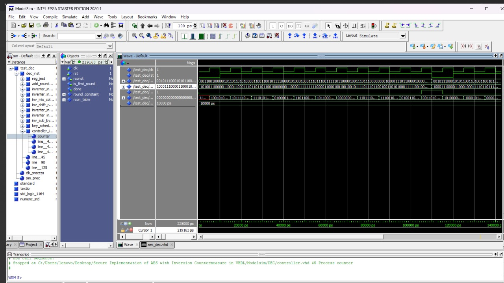

# Secure-Implementation-of-AES-with-Inversion-Countermeasure-in-VHDL

## Introduction
AES (Advanced Encryption Standard) is a widely-used symmetric encryption algorithm. It consists of several key steps for encryption, as well as their inverse operations for decryption.

## Encryption Operations

The encryption operations include:
- **Add Round Key**: Combining data with a specific round key using an XOR operation.
- **Substitution of byte**: Substituting each data byte using an S-Box substitution table.
- **Shift Rows**: Shifting bytes in each row of the data state.
- **Mix Columns**: Mixing bytes in each column of the data state through matrix multiplication.

## Decryption Operations
The inverse operations include:
- **InvMixColumns**: Inverse of column mixing through matrix operations.
- **InvShiftRows**: Inverse of row shifting compared to the encryption operation.
- **InvSubBytes**: Inverse of byte substitution using the inverse substitution table.

## Security and Configuration
By using these iterative operations for each encryption round, AES provides a high level of security. In this project, AES-128 with a 128-bit key was used, requiring 10 encryption rounds.

## VHDL Implementation
The operations were implemented in VHDL as separate components. A multiplexer and a register were added to detect the final round of encryption and facilitate control.

## Inversion Countermeasure
To disrupt power analysis attacks, two inverter blocks were added after each encryption or decryption operation. This introduces additional noise in power consumption without affecting the final result.

## Code Organization
The VHDL code is organized into two distinct files for encryption and decryption. 

## Verification
Code validity was verified through simulation on Modelsim, using a test bench with 128-bit input data for encryption.

## Acknowledgments
Please refer to the source code for more details on the implementation, and check the comments within the code for a deeper understanding.
